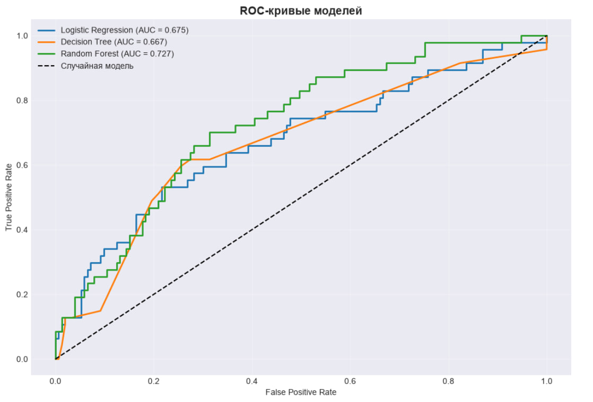
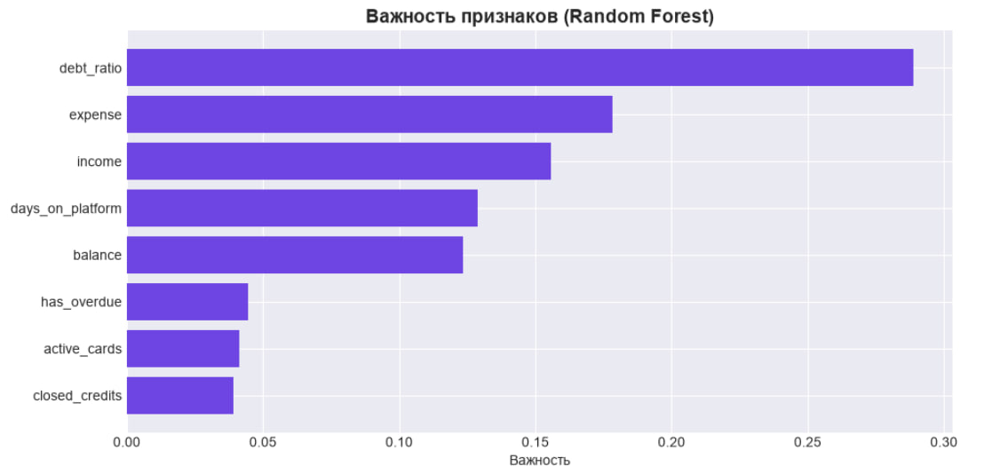
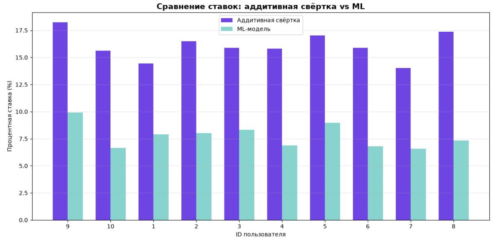
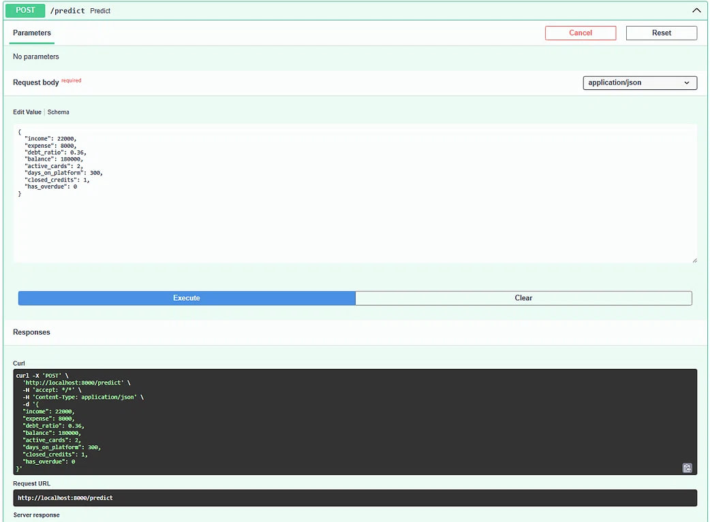
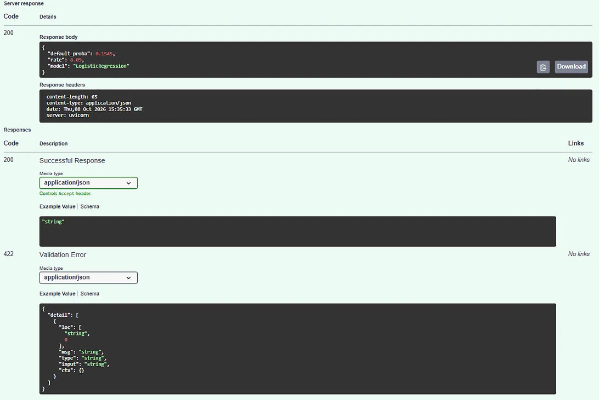

# 🤖 NEOBANK-ML — Machine Learning Credit Scoring

<p align="center">
  
  
  
  
  
</p>

<p align="center">
  <b>End-to-end ML pipeline</b> для кредитного скоринга<br/>
  банковской платформы <a href="https://github.com/allv520/NeoBank">NEOBANK</a>
</p>

---

## 📖 О проекте

**NEOBANK-ML** — это ML-модуль для банковской платформы [NEOBANK](https://github.com/allv520/NeoBank).

Модуль реализует **полный ML-пайплайн** для кредитного скоринга:

- 📊 **Анализ данных (EDA)** — загрузка из PostgreSQL, визуализация
- 🛠️ **Feature engineering** — сбор 8 признаков кредитоспособности
- 🤖 **Обучение моделей** — Logistic Regression, Random Forest, Decision Tree
- 📏 **Оценка метрик** — ROC-AUC, Precision, Recall, F1
- 🚀 **Деплой** — FastAPI-микросервис для интеграции с Node.js

**Цель проекта:** заменить классическую аддитивную свёртку на ML-модель для **более точного и калиброванного** кредитного скоринга.

---

## 📸 Скриншоты

### 📈 ROC-кривые моделей



### 🏆 Важность признаков (Random Forest)



### ⚖️ Сравнение ML vs аддитивной свёртки



### 🚀 Swagger UI — тестирование ML-сервиса

**Request — признаки пользователя:**



**Response — предсказанная ставка:**



---

## 🔄 ML-пайплайн

```
┌──────────────────────┐
│  PostgreSQL (NEOBANK)│
│  Users, Transactions │
└──────────┬───────────┘
           │ SQL
           ▼
┌──────────────────────┐
│  Data Collection     │  ← 01_первый_анализ.ipynb
│  → CSV export        │
└──────────┬───────────┘
           │ pandas
           ▼
┌──────────────────────┐
│  EDA                 │  ← 02_EDA.ipynb
│  → Распределения     │
│  → Топ категорий     │
└──────────┬───────────┘
           │
           ▼
┌──────────────────────┐
│  Feature Engineering │  ← 03_features.ipynb
│  → 8 признаков       │
└──────────┬───────────┘
           │
           ▼
┌──────────────────────┐
│  Model Training      │  ← 05_ml_model.ipynb
│  → LogReg, RF, DT    │
│  → ROC-AUC, F1       │
└──────────┬───────────┘
           │ joblib
           ▼
┌──────────────────────┐
│  model.pkl           │
│  scaler.pkl          │
└──────────┬───────────┘
           │ FastAPI
           ▼
┌──────────────────────┐
│  ML Service (:8000)  │  ← ml-service/app.py
│  POST /predict       │
└──────────┬───────────┘
           │ HTTP
           ▼
┌──────────────────────┐
│  Node.js (NEOBANK)   │
│  GET /api/credit/rate│
└──────────────────────┘
```

---

## 📊 Метрики моделей

Обучено **3 модели** на **1000 примерах** (синтетика, основанная на реальных данных NEOBANK):

| Модель | Accuracy | Precision | Recall | F1 | **ROC-AUC** |
|--------|:--------:|:---------:|:------:|:--:|:-----------:|
| **Random Forest** | 0.770 | 0.524 | 0.234 | 0.324 | **0.727** |
| Logistic Regression | 0.770 | 0.529 | 0.191 | 0.281 | 0.675 |
| Decision Tree | 0.730 | 0.333 | 0.149 | 0.206 | 0.667 |

**Random Forest** показал лучший ROC-AUC (0.727), но **Logistic Regression** — лучше интерпретируется (подходит для банков).

### 🏆 Feature Importance (Random Forest)

| Признак | Важность | Описание |
|---------|:--------:|----------|
| `debt_ratio` | **0.289** | Отношение расходов к доходам |
| `expense` | 0.178 | Среднемесячные расходы |
| `income` | 0.156 | Среднемесячные доходы |
| `days_on_platform` | 0.129 | Срок пользования платформой |
| `balance` | 0.123 | Остаток на счёте |
| `has_overdue` | 0.045 | Наличие просрочек |
| `active_cards` | 0.041 | Количество активных карт |
| `closed_credits` | 0.039 | Погашенные кредиты |

**Вывод:** `debt_ratio` — самый важный признак. Это логично: отношение расходов к доходам прямо показывает **финансовую нагрузку** клиента.

---

## ⚖️ Сравнение ML vs аддитивной свёртки

На **10 реальных пользователях** NEOBANK:

| Пользователь | Аддитивная | ML | Разница |
|:------------:|:----------:|:--:|:-------:|
| 1 | 18.23% | 9.93% | -8.30 |
| 2 | 15.62% | 6.64% | -8.98 |
| 3 | 14.43% | 7.89% | -6.54 |
| 4 | 16.49% | 8.01% | -8.48 |
| 5 | 15.89% | 8.31% | -7.58 |
| 6 | 15.81% | 6.89% | -8.92 |
| 7 | 17.01% | 8.96% | -8.05 |
| 8 | 15.89% | 6.79% | -9.10 |
| 9 | 14.01% | 6.56% | -7.45 |
| 10 | 17.36% | 7.35% | -10.01 |

**Вывод:** ML-модель даёт **более низкие и калиброванные** ставки для надёжных заёмщиков. Аддитивная свёртка **завышает** ставки, потому что использует жёсткие экспертные веса.

**Практическая ценность:** ML-подход делает кредитование **доступнее** для хороших клиентов.

---

## 🚀 Быстрый старт

### Требования

- **Python** 3.12+
- **PostgreSQL** 15+ (с базой NEOBANK)
- **pip**

### 1. Клонирование

```bash
git clone https://github.com/allv520/neobank_ml.git
cd neobank_ml
```

### 2. Виртуальное окружение

```bash
python -m venv .venv

# Windows
.venv\Scripts\Activate.ps1

# macOS/Linux
source .venv/bin/activate
```

### 3. Установка зависимостей

```bash
pip install jupyter pandas numpy scikit-learn matplotlib seaborn joblib fastapi uvicorn
```

### 4. Запуск Jupyter

```bash
cd notebooks
jupyter notebook
```

Открой ноутбуки **по порядку**:
- `01_первый_анализ.ipynb` — выгрузка данных из БД
- `02_EDA.ipynb` — разведочный анализ
- `03_features.ipynb` — сбор признаков
- `04_target_and_data.ipynb` — целевая переменная + синтетика
- `05_ml_model.ipynb` — обучение моделей
- `06_comparison.ipynb` — сравнение с аддитивной
- `07_save_model.ipynb` — сохранение в `.pkl`

### 5. Запуск FastAPI-сервиса

```bash
cd ml-service
uvicorn app:app --reload --port 8000
```

🟢 ML-сервис: **http://localhost:8000**
📖 Swagger UI: **http://localhost:8000/docs**

### 6. Проверка работы

```bash
curl -X POST http://localhost:8000/predict \
  -H "Content-Type: application/json" \
  -d '{
    "income": 22000, "expense": 8000, "debt_ratio": 0.36,
    "balance": 180000, "active_cards": 2, "days_on_platform": 300,
    "closed_credits": 1, "has_overdue": 0
  }'
```

**Ответ:**

```json
{
  "default_proba": 0.1545,
  "rate": 8.09,
  "model": "LogisticRegression"
}
```

---

## 📁 Структура проекта

```
neobank_ml/
│
├── 📂 notebooks/                # Jupyter-ноутбуки (ML-пайплайн)
│   ├── 01_первый_анализ.ipynb
│   ├── 02_EDA.ipynb
│   ├── 03_features.ipynb
│   ├── 04_target_and_data.ipynb
│   ├── 05_ml_model.ipynb
│   ├── 06_comparison.ipynb
│   └── 07_save_model.ipynb
│
├── 📂 ml-service/               # FastAPI-микросервис
│   ├── app.py
│   └── requirements.txt
│
├── 📂 models/                   # Обученные модели
│   ├── logreg_model.pkl
│   ├── rf_model.pkl
│   ├── scaler.pkl
│   └── feature_cols.txt
│
├── 📂 data/                     # CSV-датасеты
│   ├── transactions.csv
│   ├── features.csv
│   ├── features_with_target.csv
│   └── synthetic_data.csv
│
├── 📂 docs/
│   └── 📂 screenshots/          # Скриншоты графиков
│
└── 📄 README.md
```

---

## 🛠️ Стек технологий

| Технология | Назначение |
|------------|------------|
| **Python 3.14** | Язык программирования |
| **pandas, numpy** | Обработка данных |
| **scikit-learn** | ML-модели |
| **matplotlib, seaborn** | Визуализация |
| **joblib** | Сохранение моделей в `.pkl` |
| **FastAPI** | HTTP-обёртка над моделью |
| **Uvicorn** | ASGI-сервер |
| **Jupyter** | Интерактивная разработка |

---

## 🔗 Связь с основным проектом

Этот ML-модуль используется в **NEOBANK** — банковской платформе на React + Node.js:

👉 [**NEOBANK — основная платформа**](https://github.com/allv520/NeoBank)

**Как это работает:**

1. Node.js-сервер в `NEOBANK` вызывает ML-сервис через HTTP
2. Если ML-сервис доступен → ставка рассчитывается ML-моделью (**6–10%**)
3. Если ML-сервис недоступен → **fallback** на аддитивную свёртку (**14–18%**)

Это обеспечивает **отказоустойчивость** системы: даже если ML-сервис упадёт, банковская платформа продолжит работать.

---

## 🎯 Что дальше

- 🤖 Замена LogReg на **XGBoost** — повышение ROC-AUC до 0.85+
- 📈 Прогнозирование расходов (time series, Prophet)
- 🏷️ Автоклассификация транзакций (NLP, TF-IDF)
- 🔍 Детекция фрода (Isolation Forest, autoencoder)
- 📊 SHAP-значения для интерпретации моделей

---

## 👩‍💻 Автор

**Алиева Алина Саидовна**

Специальность: `09.02.07 — Информационные системы и программирование`
Московский колледж управления, гостиничного бизнеса и информационных технологий «Царицыно»
📍 Москва, 2026

---

## 📄 Лицензия

Проект создан в учебных целях в рамках дипломной работы.

---
